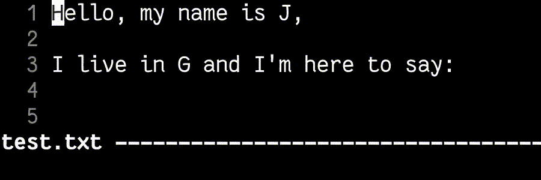

# Vim Projects

These are links to projects from the ["Usage and scripting of Vim"](https://vim-fmi.bg/) course of the Sofia University in Bulgaria.

The elective course includes 15(ish) lectures spread out over 4 months or so. The students have short daily assignments to practice using Vim, and, at the end, present a project of their own choosing using Vimscript.

Be advised that the projects are not necessarily directly installable as plugins -- they were built as assignments with time pressure, and "works on my machine" was an accepted condition. They might define global functions or use windows-specific paths, for instance.

- [Refactoring](#refactoring)
- [Tools](#tools)
- [Games](#games)

## Refactoring

### CPP Plugin

Source: <https://github.com/rayagrigorova/cpp_plugin.vim>

> This plugin includes functionality that I often needed in the Introduction to Programming and Object Oriented Programming courses.

### CPP Prettifier

Source: [./src/cpp_prettifier](./src/cpp_prettifier)

Prettify and indent C++ code

## Tools

### Nix update

Source: <https://github.com/reo101/nix-update.nvim>

Dynamically and asynchronously update attributes of fetch-like constructions in Nix

### Texty office

Source:
- <https://gitlab.com/Syndamia/texty-office.vim>
- <https://gitlab.com/Syndamia/texty-office>

https://github.com/fmi/vim-projects/assets/124255/26d082d6-7c68-4174-958e-60e76ae1e8ea

Convert OOXML documents (.docx, .xlsx, .pptx) to text

### Scrollbar

Source: <https://github.com/PavelSarlov/scrollbar.vim>

https://github.com/fmi/vim-projects/assets/124255/968cf3f3-c4d9-4bbe-820a-5097cd6a1431

A port of [nvim-scrollbar](https://github.com/petertriho/nvim-scrollbar) for Vim

### Textfill

Source: <https://github.com/RadoslavSV/vim-textfill>

Generate fake names, countries, and other test data, based on the character under the cursor

## Games

### Ivan Space Ninja

Source: <https://github.com/killercho/ivan-space-ninja>

https://github.com/fmi/vim-projects/assets/124255/6ac9bd38-2c83-485a-9236-d5fbf86554d6

> Game made with vim script for the Vim FMI course. The game is based on the mini-game "Journey of the prairie king" from Stardew Valley. Name comes from the scrapped name for Gordon Freeman.
